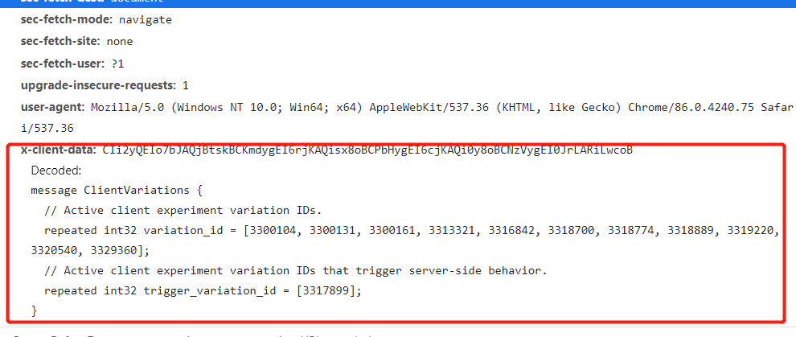

### YouTube视频下载

+ 目标网址：YouTube单视频下载
+ 链接来源：APP分享链接或web地址
+ 目标地址：api-> https://www.youtube.com/watch?v=QBjKntYuUIk
+ 加密原理：
   - 访问目标api：获取网页源代码
   - 真实的视频地址在网页源代码的args中
   - 天坑：你在浏览器中打开YouTube时和你用程序访问YouTube时，得到的网页源代码天差地别，html样式完全不同
      - 怀疑点：有没有可能是没有携带headers中的**x-client-data**参数，但这个参数十分复杂，加密方式很怪
      - 我是将程序返回的源代码粘贴到一个html文件中，格式化后，发现两者完全不一样


```
x-client-data: CIi2yQEIo7bJAQjBtskBCKmdygEI6rjKAQisx8oBCPbHygEI6cjKAQi0y8oBCNzVygEI0JrLARiLwcoB
    Decoded:
    message ClientVariations {
    // Active client experiment variation IDs.
    repeated int32 variation_id = [3300104, 3300131, 3300161, 3313321, 3316842, 3318700, 3318774, 3318889, 3319220, 3320540, 3329360];
    // Active client experiment variation IDs that trigger server-side behavior.
    repeated int32 trigger_variation_id = [3317899];
    }
```



+ 返回结果：

```json
{
    "title": "Lion Cub Gives Us His Best Roar", 
    "lengthSeconds": "53", 
    "cover": "https://i.ytimg.com/vi_webp/QBjKntYuUIk/maxresdefault.webp", 
    "quality": "720p", 
    "url": "https://r4---sn-i3belnel.googlevideo.com/videoplayback?expire=1607096473&ei=OQTKX82vJJSVigaR87mIBA&ip=119.237.87.168&id=o-AKLn7Zszrwkpm41v0QBiYgeJ_k1D3DLXlThKj9XIrfBc&itag=22&source=youtube&requiressl=yes&mh=Oe&mm=31,26&mn=sn-i3belnel,sn-npoeenle&ms=au,onr&mv=m&mvi=4&pl=22&initcwndbps=1293750&vprv=1&mime=video/mp4&ns=_rI-3A2FGiXP8py4hbnCty8F&ratebypass=yes&dur=52.616&lmt=1551827604779810&mt=1607074120&fvip=4&beids=9466587&c=WEB&txp=5535432&n=VA4yuPbuqRKg4OkCm&sparams=expire,ei,ip,id,itag,source,requiressl,vprv,mime,ns,ratebypass,dur,lmt&sig=AOq0QJ8wRAIgEjZrq2rZPqmqHR_nPKxrZvXhQcgPDv3Z5cDY2fPxC5gCIEbpxO8n-XLIvTjNwu9k1FjomkvuO62kL0pF46yCZYP7&lsparams=mh,mm,mn,ms,mv,mvi,pl,initcwndbps&lsig=AG3C_xAwRQIgBDZPNtBPCGSdvPSBe7hCqJEXjvaIRHHZHnFc1AlQISACIQC4OEFQjUwdgMiqFjI_qJHBWjuF6w2ANlhsClsyCnX1Xg=="}

```